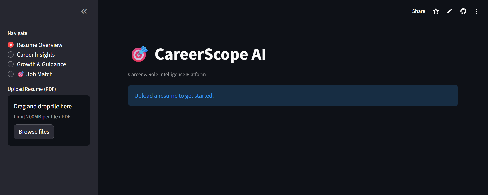
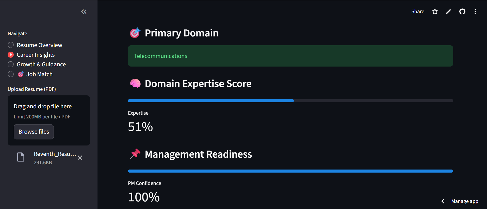
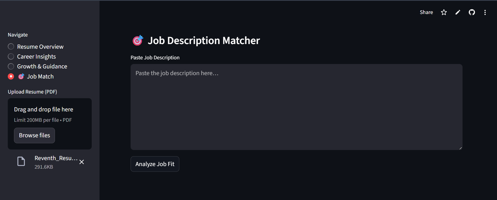

# 🎯 CareerScope AI

**CareerScope AI** is an intelligent, explainable career analysis platform that helps professionals understand:

- Their **true technical domain**
- **Resume strength vs expertise depth**
- **Role fit for specific job descriptions**
- What to **improve in their resume for a target role**

Unlike black-box resume tools, CareerScope AI focuses on **clarity, explainability, and actionable insights**.

---

## 🚀 Key Features

### 🧠 Domain Intelligence
- Detects primary technical domain:
  - Telecommunications
  - Embedded Systems
  - Cloud Engineering
  - DevOps / Platform
  - Cybersecurity
  - Data Science
- Uses keyword signals, company context (e.g., Ericsson, Verisure), and experience indicators

---

### 📊 Dual Resume Scoring System
- **Resume Structure Score (ATS Readiness)**  
  Evaluates completeness of resume sections (summary, experience, skills, projects, certifications)

- **Domain Expertise Score**  
  Measures depth of technical experience in the detected domain

This separation ensures **honest and interpretable scoring**.

---

### 🎯 Job Description Matcher
- Compares resume against a specific job description
- Produces:
  - Role Fit Score
  - Matched keywords
  - Missing ATS keywords
- Fully explainable scoring logic

---

### 🤖 AI-Powered JD-Specific Resume Improvements
- Provides targeted improvement suggestions for:
  - Professional summary
  - Experience bullets
  - Skills section
  - Certifications & leadership
- Suggestions are **role-aware**, not generic rewrites

---

### 🧭 Experience & Role Fit
- Detects experience level (Fresher / Intermediate / Experienced)
- Suggests best-fit roles such as:
  - Technical Program Manager
  - RAN Engineer
  - Embedded Systems Lead
  - Cloud / DevOps Engineer

---

## 🖥️ Screenshots

### Resume Overview

### Career Insights

### Job Description Matcher

---

## 🛠️ Tech Stack

- **Frontend & App Framework:** Streamlit
- **Resume Parsing:** PDFPlumber
- **AI Integration:** Google Gemini (via API)
- **Language:** Python
- **Hosting:** Streamlit Community Cloud

---

## 🎯 Design Philosophy

- Explainable over opaque
- Deterministic logic before AI
- No database dependency
- UX optimized for real users, not demos

---

## 🌐 Live Demo

🔗 https://career-scope-ai-cccucqraujapv5cg4vyuri.streamlit.app/

---

## 👤 Author

Built by **Reventh Thiruvallur**  
Technical Program Manager | Embedded & Telecom & Machine Learning | PMP, CAPM

---

## 📌 Future Roadmap (Optional)
- PDF export of career insights
- Multi-JD comparison
- Personalized role-based career paths
